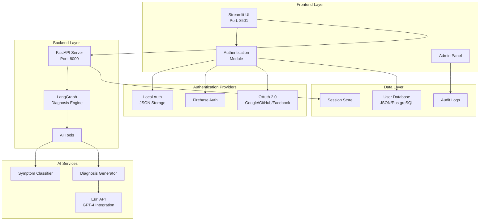

# 🩺 AI-Driven Medical Diagnostics Support System

[](https://python.org)
[](https://fastapi.tiangolo.com)
[](https://streamlit.io)
[](https://langchain.com)
[](LICENSE)

> **A comprehensive AI-powered medical diagnostics platform that analyzes patient symptoms and provides intelligent diagnosis suggestions with professional-grade authentication and user management.**

## 🌟 **Key Features**

- 🤖 **AI-Powered Diagnosis**: Advanced symptom analysis using LangChain and custom AI models
- 🔐 **Multi-Auth System**: Local, Firebase, and OAuth 2.0 (Google, GitHub, Facebook)
- 👥 **Role-Based Access**: User, Doctor, and Admin roles with different permissions
- 🎨 **Modern UI**: Professional Streamlit interface with responsive design
- 📊 **Real-time Analytics**: System monitoring and user activity tracking
- 🛡️ **Enterprise Security**: Session management, account lockout, audit trails
- 🚀 **Production Ready**: Docker support, environment configuration, scalable architecture

## 🏗️ **System Architecture**



## 📁 **Project Structure**

```
AI-Driven-Medical-Diagnostics/
├── 📂 langserve_backend/          # FastAPI Backend Service
│   ├── main.py                    # FastAPI application entry point
│   ├── diagnostics_graph.py       # LangGraph workflow engine
│   ├── requirements.txt           # Backend dependencies
│   ├── 📂 tools/                  # AI diagnostic tools
│   │   ├── diagnosis_tool.py      # AI diagnosis generator
│   │   └── symptom_checker.py     # Symptom categorization
│   └── 📂 utils/                  # Utility modules
│       └── euri_client.py         # External AI API client
├── 📂 streamlit_ui/               # Frontend Application
│   ├── app.py                     # Main Streamlit application
│   ├── auth.py                    # Authentication system
│   ├── auth_config.py             # Auth provider configuration
│   ├── admin_panel.py             # Administrative interface
│   ├── requirements.txt           # Frontend dependencies
│   └── .env.example               # Environment template
├── 📂 medic_env/                  # Python virtual environment
├── README.md                      # This file
└── .gitignore                     # Git ignore rules
```

## 🚀 **Quick Start**

### **Prerequisites**
- Python 3.10+
- Virtual environment (recommended)
- Git

### **1. Clone & Setup**
```bash
git clone https://github.com/erickyegon/Medical-Diagnosis.git
cd Medical-Diagnosis
python -m venv medic_env
source medic_env/bin/activate  # On Windows: medic_env\Scripts\activate
```

### **2. Backend Setup**
```bash
cd langserve_backend
pip install -r requirements.txt
uvicorn main:app --host 0.0.0.0 --port 8000
```

### **3. Frontend Setup**
```bash
cd ../streamlit_ui
pip install -r requirements.txt
streamlit run app.py
```

### **4. Access the Application**
- **Frontend UI**: http://localhost:8501
- **Backend API**: http://localhost:8000
- **API Documentation**: http://localhost:8000/docs
- **LangServe Playground**: http://localhost:8000/diagnose/playground/

### **5. Default Login Credentials**
```
Admin Account:
Username: admin
Password: admin123

Doctor Account:
Username: doctor  
Password: doctor123
```

## 🔐 **Authentication System**

### **Supported Authentication Methods**

| Method | Status | Features |
|--------|--------|----------|
| 🔑 **Local Auth** | ✅ Active | Username/Password, Account Lockout, Session Management |
| 🔥 **Firebase** | 🔧 Configurable | Email/Password, Social Login, Real-time Sync |
| 🔵 **Google OAuth** | 🔧 Configurable | Single Sign-On, Profile Integration |
| 🐙 **GitHub OAuth** | 🔧 Configurable | Developer-friendly Authentication |
| 📘 **Facebook OAuth** | 🔧 Configurable | Social Media Integration |

### **Security Features**
- 🛡️ **Password Hashing**: SHA-256 with salt
- ⏱️ **Session Timeout**: Configurable session management
- 🔒 **Account Lockout**: Brute force protection
- 👥 **Role-Based Access**: User/Doctor/Admin permissions
- 📋 **Audit Trail**: Complete activity logging

### **OAuth Setup (Optional)**
```bash
# Copy environment template
cp streamlit_ui/.env.example streamlit_ui/.env

# Edit .env with your OAuth credentials:
# - Google: Google Cloud Console
# - GitHub: GitHub Developer Settings  
# - Facebook: Facebook Developers
```

## 🏥 **Medical AI Features**

### **Diagnosis Pipeline**
1. **Symptom Input**: Natural language symptom description
2. **Categorization**: AI-powered symptom classification
3. **Analysis**: Advanced diagnostic reasoning
4. **Recommendations**: Treatment suggestions and next steps

### **AI Capabilities**
- 🧠 **Symptom Classification**: Neurological, Respiratory, Gastrointestinal, etc.
- 🔍 **Differential Diagnosis**: Multiple possible conditions
- 💊 **Treatment Suggestions**: Evidence-based recommendations
- ⚠️ **Risk Assessment**: Urgency and severity indicators

### **Example Usage**
```json
{
  "input": "I have a severe headache, fever, and neck stiffness"
}
```

**Response:**
```json
{
  "input": "I have a severe headache, fever, and neck stiffness",
  "symptom_area": "Neurological",
  "diagnosis": "Based on the symptoms of severe headache, fever, and neck stiffness, this could indicate meningitis or other serious neurological conditions. Immediate medical attention is required..."
}
```

## 👥 **User Roles & Permissions**

| Role | Permissions | Features |
|------|-------------|----------|
| 👤 **User** | Basic Access | Symptom input, diagnosis viewing, personal history |
| 👨‍⚕️ **Doctor** | Enhanced Access | Patient management, detailed reports, medical insights |
| ⚙️ **Admin** | Full Access | User management, system settings, audit logs, analytics |

## 📊 **Admin Dashboard**

- 👥 **User Management**: Create, edit, delete users
- 📈 **Analytics**: Usage statistics and trends  
- 🔧 **System Settings**: Configuration management
- 📋 **Audit Logs**: Security and activity monitoring
- 🛠️ **Maintenance**: System health and diagnostics

## 🛠️ **Development**

### **API Endpoints**
```
GET  /                     # Health check
POST /test                 # Simple diagnosis test
POST /diagnose/invoke      # Main diagnosis endpoint
GET  /docs                 # API documentation
GET  /diagnose/playground/ # Interactive testing
```

### **Environment Variables**
```bash
# Authentication
SECRET_KEY=your-secret-key
SESSION_TIMEOUT=3600
MAX_LOGIN_ATTEMPTS=3

# OAuth Providers
GOOGLE_CLIENT_ID=your-google-client-id
GITHUB_CLIENT_ID=your-github-client-id
FIREBASE_API_KEY=your-firebase-key

# API Configuration
BACKEND_URL=http://localhost:8000
API_TIMEOUT=30
```

### **Testing**
```bash
# Backend tests
cd langserve_backend
python -m pytest

# Frontend tests  
cd streamlit_ui
streamlit run app.py --server.headless true
```

## 🚢 **Deployment**

### **Docker Deployment**
```bash
# Build and run with Docker Compose
docker-compose up -d

# Or build individually
docker build -t medical-backend ./langserve_backend
docker build -t medical-frontend ./streamlit_ui
```

### **Production Considerations**
- 🔒 Change default passwords
- 🌐 Configure proper domain names
- 📊 Set up monitoring and logging
- 🔐 Use environment-specific secrets
- 📈 Configure auto-scaling

## ⚠️ **Medical Disclaimer**

> **IMPORTANT**: This application is designed for educational and informational purposes only. It should NOT be used as a substitute for professional medical advice, diagnosis, or treatment. Always seek the advice of qualified healthcare providers with any questions regarding medical conditions.

## 🤝 **Contributing**

1. Fork the repository
2. Create a feature branch (`git checkout -b feature/amazing-feature`)
3. Commit changes (`git commit -m 'Add amazing feature'`)
4. Push to branch (`git push origin feature/amazing-feature`)
5. Open a Pull Request

## 📄 **License**

This project is licensed under the MIT License - see the [LICENSE](LICENSE) file for details.

## 👨‍💻 **Author**

**Erick Yegon**
- GitHub: [@erickyegon](https://github.com/erickyegon)
- Email: erickkiprotichyegon61@gmail.com

## 🙏 **Acknowledgments**

- LangChain team for the AI framework
- FastAPI for the robust backend framework
- Streamlit for the intuitive frontend framework
- Euri API for AI model integration

---

<div align="center">
  <strong>Built with ❤️ for better healthcare accessibility</strong>
</div>
